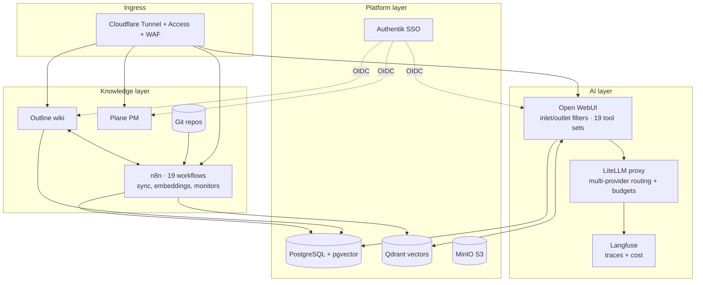

# I Built My Own AI Product Operating System

*A product manager's self-hosted stack: multi-agent RAG, discovery automation, and what running it in production taught me about shipping AI features.*

> **In this repo:**
> 📖 This case study — why and what
> 🔬 [720,000 Customer Signals, One Opportunity Tree](./discovery-pipeline.md) — deep-dive into the AI discovery pipeline and its evaluation harness
> ⚙️ [n8n Workflows](./n8n-workflows/) — sanitized, importable production workflows (sync, cost governance, reliability) with a PM-lens explainer

---

## Why

I'm a product manager, not an infrastructure engineer. I built this anyway, for two reasons:

1. **Data sovereignty.** I wanted an AI assistant grounded in my real product context — meeting notes, customer signals, strategy docs, backlog state. That context belongs to my employer and to me, and customer feedback is personal data under GDPR — so identifiers are stripped locally before any text reaches an external API, and piping raw context through third-party SaaS agents wasn't acceptable. Self-hosting was the only honest answer.
2. **Judgment.** Every PM now writes roadmaps with "AI" on them. Very few have personally debugged a tool-calling loop, tuned retrieval thresholds, or watched an LLM hallucinate structured output at 2am. I wanted to know — from the inside — where the demos end and the engineering begins.

Four months later it's not a demo. It's the system I do my job with every day.

---

## What it is

A single Hetzner VPS running ~18 Dockerized services, publicly reachable only through a Cloudflare Tunnel — zero open inbound ports. Three layers:

**1. The platform layer** — shared infrastructure:

| Concern | Service |
|---|---|
| Database | PostgreSQL (pgvector) |
| Vector search | Qdrant |
| Object storage | MinIO (S3-compatible) |
| Identity / SSO | Authentik (OIDC) |
| Ingress | Cloudflare Tunnel + Access |
| Monitoring | Uptime Kuma + scheduled health workflows |

**2. The knowledge layer** — where product context lives and moves:

- **Outline** (wiki) and **Plane** (project management) as working tools
- A **three-way sync pipeline**: team wiki (Confluence) → Outline → Git → vector embeddings in Qdrant, so the AI layer always reasons over *current* product context, not a stale export
- **n8n** orchestrating 19 active workflows: embedding pipelines, comment handlers, budget monitors, background research workers

**3. The AI layer** — the part that earns its keep:

- **Open WebUI** as the chat surface, with global inlet/outlet filters I wrote in Python:
  - *Inlet*: embeds each user message, retrieves scoped context from Qdrant, injects agent personality + live knowledge-tree + memories into the system prompt — in ~300ms
  - *Outlet*: embeds every conversation turn back into the vector store, so the system remembers
- **LiteLLM** as a model-routing proxy (Claude, Mistral, open-weight models behind one API, with budgets and rate limits)
- **Langfuse** for tracing and cost observability — every LLM call inspected and priced
- **19 custom tool sets, ~80 tool methods**: wiki CRUD, task management, email, calendar, Confluence, Figma, web search with synthesis, deep research (fire-and-forget background jobs), sandboxed code execution in throwaway containers, slide-deck generation
- **Multi-agent support**: agents are rows in a database — personality, scoped retrieval filters, per-agent top-k and thresholds. Deploying a new agent is a script, not a rebuild.

---

## Architecture

---

## Five problems that taught me the most

### 1. Native tool calling vs. the hallucination tax

Early on, tool calls went through a text-based fallback: a "task model" parsed the LLM's intent and emitted tool invocations as XML. It worked in demos and failed in production — models hallucinated malformed XML, calls silently dropped. The fix was forcing **native function calling** through the OpenAI `tools` parameter with a proper multi-turn loop (up to 30 rounds), and disabling the built-in tools that conflicted with custom ones.

*PM lesson: "supports tool calling" on a spec sheet spans a 10x reliability range depending on the integration path. I now ask engineers* which *tool-calling mechanism, not whether.*

### 2. Three-way sync without infinite loops

Content flows Confluence → Outline → Git → vector store, and edits can originate at any point. Naive bidirectional sync loops forever. The fix is boring and effective: sync-originated commits carry a `[sync]` marker that downstream workflows ignore, webhooks are scoped per direction, and one source of truth is designated per content zone — wiki content is Confluence-mastered, operational content is Git-mastered, and nothing is mastered twice.

*PM lesson: most "AI knowledge base" failures aren't retrieval failures — they're content-pipeline failures. Garbage-in is an architecture problem.*

### 3. Retrieval quality is a product surface

With everything embedded into one collection, the agent retrieved *plausible* chunks instead of *relevant* ones — duplicated content across zones ate the top-k slots. Fixes: deduplicate at the source (one canonical home per topic), per-agent metadata filters for scoped retrieval, and per-agent top-k/threshold overrides. Mean-centering cosine similarities mattered too: multilingual embeddings bunch in a narrow band, and only centered similarities discriminate.

*PM lesson: RAG quality is not a model property. It's corpus hygiene + retrieval tuning, and it needs an owner — usually the PM, because it's a content-strategy problem wearing a math costume.*

### 4. Security as a regression class

An LLM platform with 80 tool methods is an attack surface: SSRF through URL-fetching tools, path traversal through file tools, credential leaks through raw exception messages. I treated these as lint rules, not vibes — a custom linter plus pre-commit hooks reject any code path that returns `str(e)` to a user, every outbound URL is validated against private-IP ranges, and a regression + security test suite gates every commit. All images version-pinned, all ports bound to localhost, ingress only via tunnel.

*PM lesson: "we'll harden it later" doesn't survive contact with tools that can read email and execute code. Security constraints belong in the acceptance criteria of every AI-tool story, not in a phase-2 epic.*

### 5. Evaluating an AI pipeline you actually rely on

The flagship use case is a discovery pipeline: ~720k raw customer signals (support cases, call transcripts, chatbot logs, service-desk tickets, product analytics) normalized to one schema, PII-redacted at the boundary, classified against a versioned theme taxonomy, embedded, clustered, summarized by an LLM, and pushed as scored opportunities into a Jira Product Discovery tree. Before trusting it, I built the rulers: a hand-labelled gold set with precision/recall/F1 scoring, a cluster-coherence metric to catch grab-bag clusters, and a summary-faithfulness check that verifies every quoted customer statement actually exists in the source signals.

*PM lesson: an unevaluated AI pipeline is a liability generator. The eval harness is not optional tooling — it IS the product quality bar, and writing it taught me more than the pipeline itself.*

→ *Full write-up: [720,000 Customer Signals, One Opportunity Tree](./discovery-pipeline.md)*

---

## By the numbers

- **~18** services, one VPS, **0** open inbound ports
- **19** active automation workflows; **19** custom tool sets, **~80** tool methods
- **720k+** customer signals processed into **65** evidence-linked opportunities
- **~300ms** retrieval-and-injection overhead per chat message
- **4 months** from empty server to daily production use
- **100%** of LLM spend traced and budgeted

---

## What I'd tell another PM

Build something real with this technology, even small. Not to become an engineer — I'm still not one — but because the judgment is not absorbable from blog posts. Knowing *viscerally* why retrieval degrades, what tool-calling reliability costs, where token budgets explode, and how content pipelines rot is the difference between writing an AI roadmap and writing a credible one.

The stack changed how I scope AI features at my day job: I know which "two-week" AI items are two weeks and which are two quarters. That's the whole return on investment, and it's been worth every weekend.

---

*Stack: Docker Compose · PostgreSQL/pgvector · Qdrant · MinIO · Authentik · Cloudflare Tunnel · n8n · Outline · Plane · Open WebUI · LiteLLM · Langfuse · SearXNG · Python · Hetzner*
