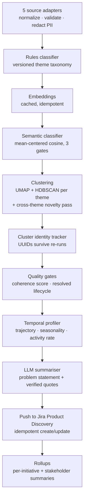

# 720,000 Customer Signals, One Opportunity Tree

*How I automated product discovery: a pipeline that turns raw customer signals into an evidence-linked, scored opportunity backlog — and the evaluation harness that makes it trustworthy.*

> Companion piece to [I Built My Own AI Product Operating System](./README.md). The pipeline runs on that stack. Numbers reflect a June 2026 snapshot; the system is in active iteration.

---

## The problem

Continuous discovery says: talk to customers weekly, map opportunities, let evidence drive prioritization. The reality at most companies: the evidence already exists in overwhelming volume — support cases, sales-call transcripts, chatbot conversations, service-desk tickets, product analytics — and no PM can read it. So discovery runs on anecdote and recency bias, while hundreds of thousands of customer statements sit unread in five different systems.

I had ~720,000 signals across five sources. The question wasn't "how do we get customer input?" It was "how do we hear what we've already been told?"

## What it does

A Python pipeline that ingests raw signals from five source systems and maintains a scored, evidence-linked **Opportunity-Solution Tree** in Jira Product Discovery. Each opportunity it creates carries:

- A problem statement a PM could brief a designer on
- Verbatim customer quotes (verified — more below)
- Volume, trajectory (rising/stable/declining), and seasonality
- Suggested importance and discovery-horizon — *suggestions only; the PM stays authoritative*

It refreshes weekly. Pushes are idempotent: the same cluster updates the same ticket across runs instead of duplicating it.

## Design principles

**1. One contract, any source.** Every adapter — CRM cases, call transcripts, chat logs, service-desk tickets, analytics events — emits the same `Signal` JSON shape, validated against a schema. Adding a source is an adapter, not a rebuild.

**2. Direct identifiers die at the boundary — by design.** Customer feedback is personal data under GDPR, so identifiers are stripped at ingestion, on local infrastructure, before any text leaves the machine: emails, phone numbers, IBANs, VAT and national-ID numbers are redacted by rule, and identifiers that must survive for joining (customer IDs, org names) are HMAC-hashed with a fixed salt — stable joins, no reversibility. Only de-identified text is sent to external services — embeddings via an EU provider (Mistral), summarisation via an LLM — both under data-processing terms that opt out of training on inputs. All clustering and classification runs locally. Raw customer PII never reaches the always-on VPS or the opportunity tree; only the final aggregated output does.

**3. Suggestions, never decisions.** The pipeline writes "Importance suggestion: 5/5 (base 3, rising +1, cross-cutting +1)" into the ticket description. It does not set the field. Automated scoring that PMs can't override gets ignored; transparent reasoning they can accept or reject builds trust.

**4. No push without identity.** A cluster that survives a re-run keeps its UUID (Jaccard overlap on membership), so the JPD ticket updates in place. Clusters have a lifecycle: active → drifted → resolved → retired. A problem that's gone quiet for months stops being pushed — and comes back automatically if it resurges.

**5. Measure before trusting.** Nothing reached the team's backlog until the evaluation harness existed (below).

## Architecture

Thirteen stages, one orchestrator, fully re-runnable. Every tunable threshold lives in one YAML file with a PM-readable companion doc explaining each knob's rationale and valid range — retuning is an edit and a re-run, not code surgery.

## The evaluation harness — the part that matters most

An unevaluated AI pipeline pushing into your team's backlog is a noise generator with good PR. Before trusting the output, I built four rulers:

| Ruler | What it catches |
|---|---|
| **Gold set** — 160 hand-labelled signals, stratified by source and month, scored for precision/recall/F1 | Classifier drift; every change is benchmarked against committed baselines |
| **Cluster coherence** — mean within-cluster cosine similarity | Grab-bag clusters that would become incoherent tickets; low-coherence clusters are gated from push |
| **Summary faithfulness** — every quoted customer statement is verified to exist in the source signals | LLM hallucination in the most damaging place: fabricated customer evidence |
| **Naming lint** — enforced title convention | Tickets a PM can scan in a board view |

The bar is explicit and honest: **at most 1 in 10 surfaced opportunities may be noise** — not zero, because chasing zero false positives silently costs you recall, and missed patterns are the expensive failure mode in discovery.

## Hard-won lessons

**Multilingual embeddings don't discriminate out of the box.** Raw cosine similarities between Dutch/French/English customer text and theme descriptions all bunched in a narrow band — everything looked moderately similar to everything. Subtracting the corpus centroid from both sides before comparing (mean-centering) restored contrast. One linear-algebra line, weeks of confusion.

**Noise is an ingestion problem, not a classification problem.** The labelled noise in my gold set was 100% identifiable by *what the message was* — automated dunning mails, system reports, autoreplies, internal tooling tickets — not by what it said. No classifier tuning fixes that; the adapter has to drop those signals at the source. I spent classifier effort before realizing the fix belonged two stages earlier.

**Strip the agent, keep the customer.** Support-case threads are mostly agent boilerplate — reply templates, signatures, legal footers. Embedding whole threads clusters tickets by *which template the agent used*. Extracting only the customer's words before embedding was one of the highest-leverage changes in the entire pipeline.

**Problems have lifecycles, and your pipeline needs to know.** Without a resolved-cluster mechanism, every pain your team ever fixed keeps reappearing in the backlog at full historical volume. Tracking recent activity rate alongside all-time frequency — and retiring quiet, declining clusters reversibly — turned the tree from an archive into a living artifact.

**The eval harness teaches you more than the pipeline.** Labelling 160 signals by hand changed my theme taxonomy twice and my noise definition once. The act of building the ruler is where the domain understanding actually forms.

## By the numbers (June 2026 snapshot)

- **~720,000** signals across **5** sources, normalized to one schema
- **65** evidence-linked opportunities live in the team's opportunity tree
- **13** pipeline stages, **~30** tunable parameters in one YAML
- **160**-signal hand-labelled gold set; classification F1 tracked against committed baselines on every change
- **100%** of quoted customer statements machine-verified against source signals
- Full refresh: ~30 minutes. Cadence: weekly.

## What changed in practice

The opportunity tree stopped being a workshop artifact and became a queryable system: every opportunity traceable to real customer statements, with volume and trend attached. Prioritization conversations shifted from "I think this matters" to "this is rising 2.4× with 59% of signals crossing two themes — and here are eleven customers saying it."

The pipeline doesn't decide anything. It makes sure that when I decide, I've heard everyone.

---

*Status: in production, in active iteration. The code is private — it's tuned to my employer's data and taxonomy — but the architecture above is the whole shape, and every idea in it is reproducible from this description.*
